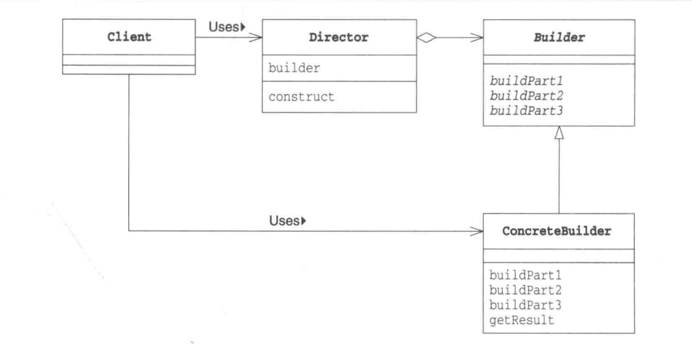

# Builder Pattern 
----
### 将一个复杂对象的构造与它分开，使得同样的构造过程可以产生不同的对象。
> 建造者模式是一步一步创建一个复杂的对象，它允许用户只通过指定复杂对象的类型和内容就可以构建它们，用户不需要知道内部的具体构建细节。建造者模式属于对象创建型模式。根据中文翻译的不同，建造者模式又可以称为生成器模式。
> 

## 图示

Builder：抽象建造者

ConcreteBuilder：具体建造者

Director：指挥者

Product：产品角色

---

  
 

## 建造者模式与工厂模式的区别

  我们可以看到，建造者模式与工厂模式是极为相似的，总体上，建造者模式仅仅只比工厂模式多了一个“导演类”的角色。在建造者模式的类图中，假如把这个导演类看做是最终调用的客户端，那么图中剩余的部分就可以看作是一个简单的工厂模式了。

  与工厂模式相比，建造者模式一般用来创建更为复杂的对象，因为对象的创建过程更为复杂，因此将对象的创建过程独立出来组成一个新的类——导演类。也就是说，工厂模式是将对象的全部创建过程封装在工厂类中，由工厂类向客户端提供最终的产品；而建造者模式中，建造者类一般只提供产品类中各个组件的建造，而将具体建造过程交付给导演类。由导演类负责将各个组件按照特定的规则组建为产品，然后将组建好的产品交付给客户端。
  
  
