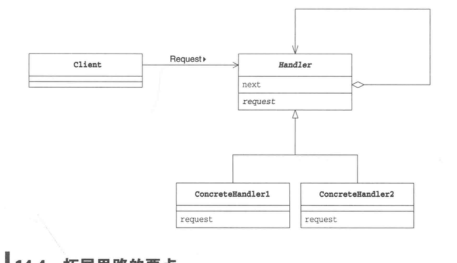

# Chain of Responsibility  Pattern（职责链模式）

---
## 说明
**推卸责任** ： 公司领取资料，首先我们向公司前台打听要去哪里领取资料，她告诉我们到了营业窗口，然后营业窗口告诉我们去其他窗口，这就是推卸责任

当外部请求程序进行某个处理，但是程序暂时无法直接决定由哪个对象负责处理时，就需要推卸责任。我们可以考虑**将多个对象组成一条职责链，然后按照他们在职责链上的顺序一个一个找出来到底应该谁来负责处理**。

## 图解
 
  
 
 