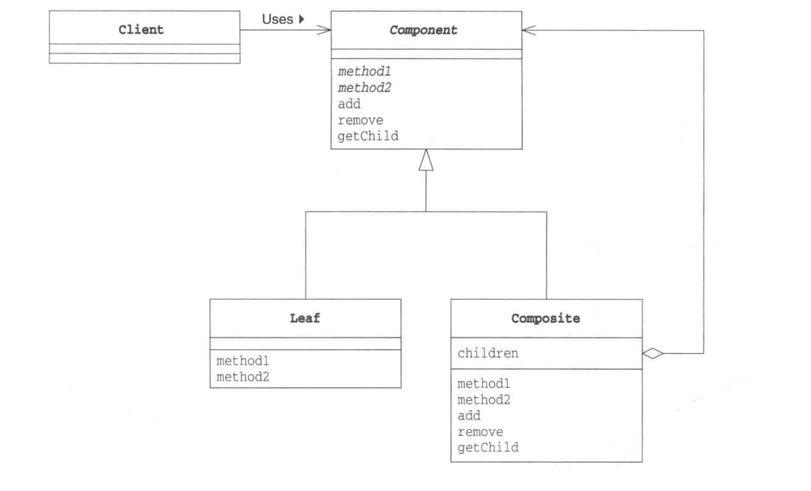

# Composte Pattern 组合模式
### 容器与内容的一致性

> 组合多个对象形成树形结构以表示具有“整体—部分”关系的层次结构。组合模式对单个对象（即叶子对象）和组合对象（即容器对象）的使用具有一致性，组合模式又可以称为“整体—部分”(Part-Whole)模式，它是一种对象结构型模式。
>

## 图解

● Component（抽象构件）：它可以是接口或抽象类，为叶子构件和容器构件对象声明接口，在该角色中可以包含所有子类共有行为的声明和实现。在抽象构件中定义了访问及管理它的子构件的方法，如增加子构件、删除子构件、获取子构件等。

● Leaf（叶子构件）：它在组合结构中表示叶子节点对象，叶子节点没有子节点，它实现了在抽象构件中定义的行为。对于那些访问及管理子构件的方法，可以通过异常等方式进行处理。

● Composite（容器构件）：它在组合结构中表示容器节点对象，容器节点包含子节点，其子节点可以是叶子节点，也可以是容器节点，它提供一个集合用于存储子节点，实现了在抽象构件中定义的行为，包括那些访问及管理子构件的方法，在其业务方法中可以递归调用其子节点的业务方法。

---

  
 

## 组合

### Java类的复用
继承可以帮助我实现类的复用。所以，很多开发人员在需要复用一些代码的时候会很自然的使用类的继承的方式。但是，其实这样做是不对的。长期大量的使用继承会给代码带来很高的维护成本。

**继承（Inheritance）**是一种联结类与类的层次模型。指的是一个类（称为子类、子接口）继承另外的一个类（称为父类、父接口）的功能，并可以增加它自己的新功能的能力，继承是类与类或者接口与接口之间最常见的关系；继承是一种is-a关系。

**组合(Composition)**体现的是整体与部分、拥有的关系，即has-a的关系。