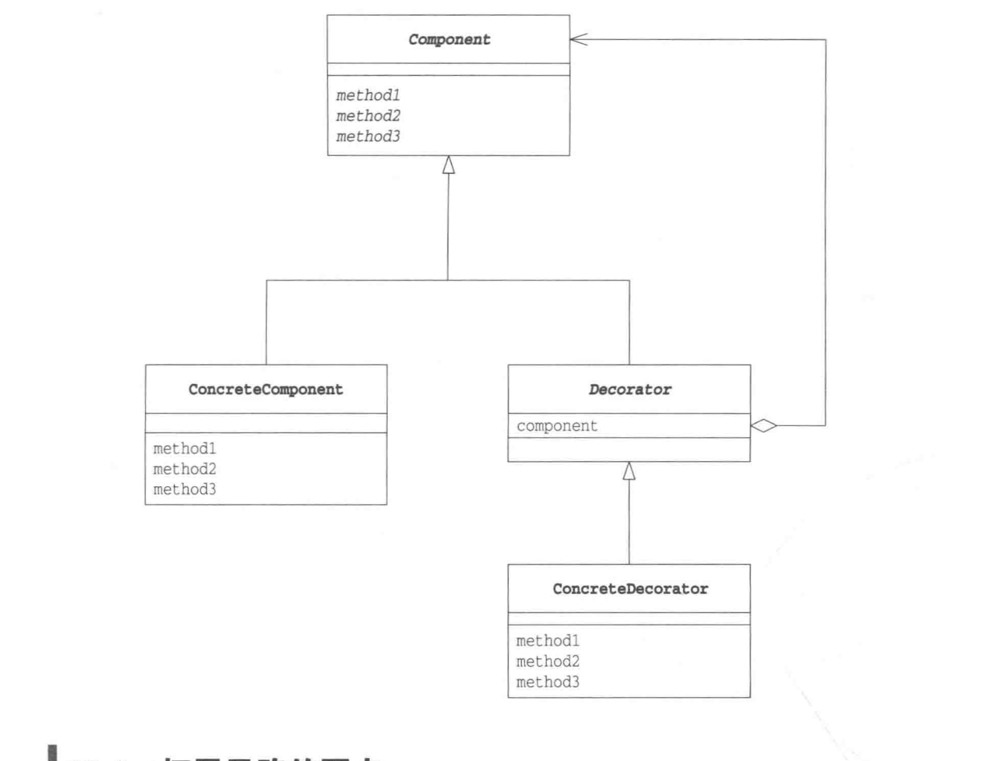

# Decortor Pattern 装饰者模式
###给爱用继承的人一个全新设计眼界

## 图示

  
 
## 开发-关闭原则

类应该对拓展开发，对修改关闭

目标是同意类容易扩展，在不修改现有代码的情况下，就可搭配新的行为，如能实现这样的目标，有什么好处？这样的设计具有弹性可以应对改变，可以接受新的功能来应对改变的需求。

定义：动态的将责任附加到对象上。若要拓展功能，装饰者提供了比继承更有弹性的替代方案

装饰者和被装饰者必须是一样的类型，也就是有共同的超类，这是相当关键的地方，在这里，我们用继承达到“类型匹配”，而不是利用继承获得”行为“

## 真实世界中的装饰者java： I/O

BufferedInputStream及LineNumberInputStream都扩展自FilterInputStream.而FilterInputStream是一个抽象的装饰类

### 主体介绍：

LineNumberInputStream也是一个具体的“装饰者”它加上了计算行数的能力
BufferedInputStream是一个具体的“装饰者”，它加入两种行为：利用缓冲输入来改进性能；用readLine()方法（用来一次读取一行文本输入数据）来增强接口

FilterInputStream是被装饰的组件。java I/O程序提供了几个组件，包括了FilInputStream,StringBuffer,.....这些类提供了最基本的字节读取功能。

## 举例子

  假如有一块蛋糕，如果上面只涂上奶油，其他什么都不加，就是奶油蛋糕。如果在上面加上草莓，那就是草莓奶油蛋糕。如果在上面加点巧克力，再写上名字，那就是一块生日蛋糕（图解设计模式，这个例子我感觉特别好）
  
## 示例图解

名字| 说明
---|---
Display | 用于显示字符串的抽象类
StringDisplay | 用于显示单行字符串的类
Border | 用于显示装饰边框的抽象类
SideBorder | 用于只显示左右边框的类
FullBorder | 用于显示上下左右边框的类
Main | 测试程序行为的类

## Decorator模式的角色组成

——抽象构件角色(Component)

给出一个个抽象接口，以规范准备接收附加责任的对象。是被装饰类和装饰类的父接口。

——具体构建角色(Concrete Component)

定义一个将要接受附加责任的类，即被装饰的类。

——装饰角色(Decorator)

装饰者，持有一个构件(Component)对象的引用，并定义一个与抽象构件接口一致的接口。

——具体装饰角色(Concrete Decorator)

具体装饰者，负责给构件对象“贴上”附加的责任（扩展功能）