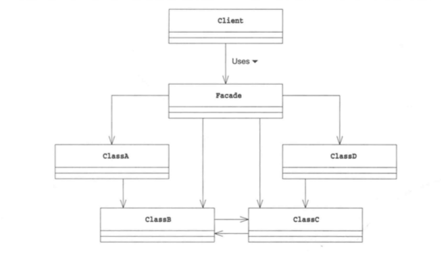

# Facade Pattern 外观模式
---

## 说明
使用外观模式可以为互相关联在一起的错综复杂的类整理出高层接口。其中的Facade角色可以让系统对外只有一个简单的接口，而且，Facade角色还会考虑到系统内部各个类之间的责任关系和依赖关系，按照正确的顺序调用各个类

## 图解

  
 

## 使用场景：
1- 为复杂的模块或子系统提供外界访问的模块；

2- 子系统相互独立；

3- 在层析结构中，可以使用外观模式定义系统的每一层的入口。

## 优点
- **松散耦合**
　　使得客户端和子系统之间解耦，让子系统内部的模块功能更容易扩展和维护；

- **简单易用**
　　客户端根本不需要知道子系统内部的实现，或者根本不需要知道子系统内部的构成，它只需要跟Facade类交互即可。

- **更好的划分访问层次**
　　有些方法是对系统外的，有些方法是系统内部相互交互的使用的。子系统把那些暴露给外部的功能集中到门面中，这样就可以实现客户端的使用，很好的隐藏了子系统内部的细节。