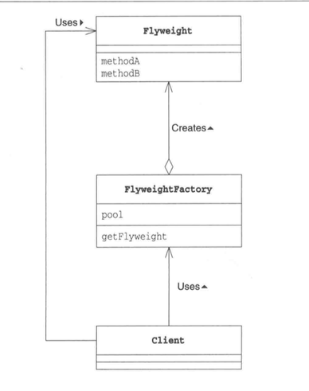

# Flyweight Pattern 享元模式
----

### 共享对象，避免浪费 (运用共享技术有效地支持大量细粒度的对象)

## 说明
FlyWeight 是轻量级的意思，为了让对象变的更轻。（**通过尽量共享实例来避免new 出实例**）

## 图示

* **Flyweight**

描述一个接口，通过这个接口 Flyweight 可以接受并作用于外部状态。

* **ConcreteFlyweight**

实现 Flyweight 接口，并为内部状态增加存储空间。该对象必须是可共享的。它所存储的状态必须是内部的，即必须独立于对象的场景。

* **UnsharedConcreteFlyweight**

并非所有的 Flyweight 子类都需要被共享。Flyweight 接口使共享成为可能，但它并不强制共享。

* **FlyweightFactory**

创建并管理 Flyweight 对象。
确保合理地共享 Flyweight。

  
 

## 场景

Flyweight 模式的有效性很大程度上取决于如何使用它以及在何处使用它。

一个应用程序使用了大量的对象。

完全由于使用大量对象，造成很大的存储开销。

对象的大多数状态都可变为外部状态。

如果删除对象的外部状态，那么可以用相对较少的共享对象取代很多组对象。

应用程序不依赖于对象标识。

