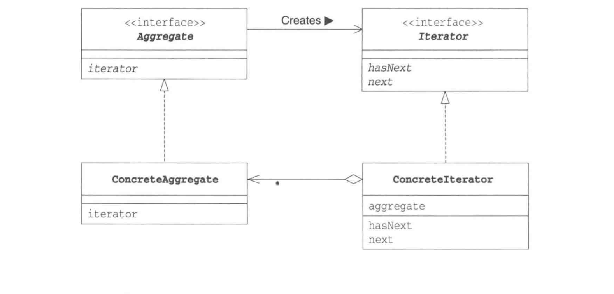

# Iterator  Pattern 迭代器模式

## 一个一个遍历

 > Iterator 模式是用于数据集合按顺序遍历集合，反复做一件事情。提供一种方法访问一个容器对象中各个元素，而又不暴露该对象的内部细节。
 
 
## 图解
 
 
  
 
 
**抽象容器**：一般是一个接口，提供一个iterator()方法，例如java中的Collection接口，List接口，Set接口等。
 
**具体容器**：就是抽象容器的具体实现类，比如List接口的有序列表实现ArrayList，List接口的链表实现LinkList，Set接口的哈希列表的实现HashSet等。

**抽象迭代器**：定义遍历元素所需要的方法，一般来说会有这么三个方法：取得第一个元素的方法first()，取得下一个元素的方法next()，判断是否遍历结束的方法isDone()（或者叫hasNext()），移出当前对象的方法remove()。

**迭代器实现**：实现迭代器接口中定义的方法，完成集合的迭代。

## 迭代器模式的优点有：

简化了遍历方式，对于对象集合的遍历，还是比较麻烦的，对于数组或者有序列表，我们尚可以通过游标来取得，但用户需要在对集合了解很清楚的前提下，自行遍历对象，但是对于hash表来说，用户遍历起来就比较麻烦了。而引入了迭代器方法后，用户用起来就简单的多了。

可以提供多种遍历方式，比如说对有序列表，我们可以根据需要提供正序遍历，倒序遍历两种迭代器，用户用起来只需要得到我们实现好的迭代器，就可以方便的对集合进行遍历了。
封装性良好，用户只需要得到迭代器就可以遍历，而对于遍历算法则不用去关心。
## 迭代器模式的缺点：

对于比较简单的遍历（像数组或者有序列表），使用迭代器方式遍历较为繁琐，大家可能都有感觉，像ArrayList，我们宁可愿意使用for循环和get方法来遍历集合。