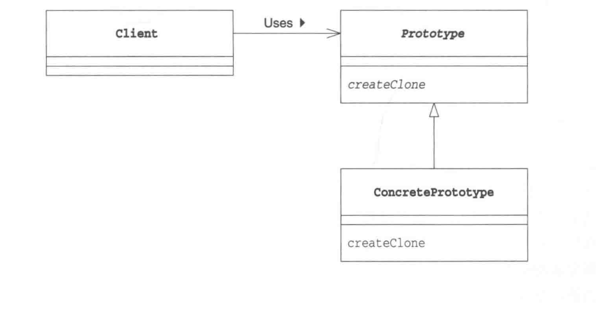

# Prototype  Pattern 原型模式

---

### 通过复制生成实例
### 原因
* 对象种类繁多，无法将它们整合到一个类中时
* 难以根据类生成实例
* 想解耦合与生成的实例

---
## 图解

<div align="center">  </div><br>

## 相关

### java的clone()

> java 语言为了我们准备用于复制实例子的clone方法，要调用clone方法，被复制的对象的类必须实现java.lang.Clonable接口还是其某一个父类实现Cloneable 接口，是被复制对象的类实现Cloneable接口的子接口都可以。
> 
> 实现Cloneable 接口的类的实例可以调用clone方法进行复制，clone方法的返回值是复制出的新的实例（clone方法内部所进行的处理是分配与要复制的实例同样大小的内存空间，接着要将复制的实例的字段的值复制到所分配的内存空间中去）
> 

## clone()

**1. cloneable** 

clone() 是 Object 的 protect 方法，它不是 public，一个类不显式去重写 clone()，其它类就不能直接去调用该类实例的 clone() 方法。

```java
package com.prototype.pattern;

/**
 * @description:
 * @author: taojian
 * @create: 2018-08-21 15:11
 * <p>
 * 如何不实现Cloneable 接口会抛下面的错误
 * <p>
 * java.lang.CloneNotSupportedException: com.prototype.pattern.CloneExample
 * at java.lang.Object.clone(Native Method)
 * at com.prototype.pattern.CloneExample.clone(CloneExample.java:17)
 * at com.prototype.pattern.CloneExample.main(CloneExample.java:23)
 **/
public class CloneExample implements Cloneable {
    private int a;
    private int b;

    @Override
    protected CloneExample clone() throws CloneNotSupportedException {
        return (CloneExample) super.clone();
    }

    public static void main(String[] args) {
        CloneExample e1 = new CloneExample();
        CloneExample e2 = null;
        try {
            e2 = e1.clone();
        } catch (CloneNotSupportedException e) {
            e.printStackTrace();
        }
        System.out.println(e1);
        System.out.println(e2);
        System.out.println(e1 == e2);
    }
}

```

应该注意的是，clone() 方法并不是 Cloneable 接口的方法，而是 Object 的一个 protected 方法。Cloneable 接口只是规定，如果一个类没有实现 Cloneable 接口又调用了 clone() 方法，就会抛出 CloneNotSupportedException。

## 深拷贝与浅拷贝
* 浅拷贝：拷贝实例和原始实例的引用类型引用同一个对象；
* 深拷贝：拷贝实例和原始实例的引用类型引用不同对象。