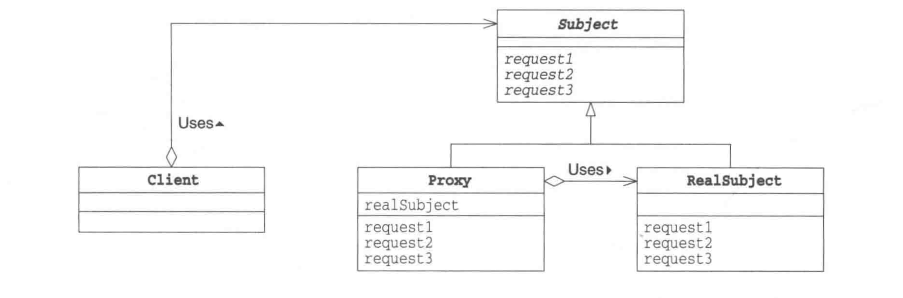

<span id="Proxy_pattern_Java"></span>
# ProxyPattern 
----
# 代理模式：控制对象访问
--

* 在headfirst的上面有一个很好例子：你是一个白脸，提供很好且很友善的服务，但是你不希望每个人都叫你做事，所以找了黑脸控制对你的访问。</p> 
*  这就是代理要做的：控制和管理访问。就像你将看到的，代理的方式有很多种。代理以通过Internet为它们的代理对象搬运的整个方法调用而出名，它以可以代替某些懒惰的对象做一些事情。</p>
* 官方定义：代理模式为另一个对象提供一个替身或占位符以控制这个对象的访问。使用代理模式创建代表对象，让代表对象控制某对象的访问，被代理的对象可以是远程的对象、创建开销大的对象或需要安全控制的对象。


# 图解
---
<div align="center">  </div><br>

## 静态代理：

###1.静态代理模式的角色分析：</p>
 >
抽象角色--一般使用接口或者抽象类来实现</p>
真实角色--被代理的角色</p>
代理角色--代理真实角色一般代理真实角色后一般会做一些附属操作。</p>
客户------使用代理角色来进行一些操作</p>

--


 下面以房屋租房来说明一些静态代理模式，这里主要有三个角色：房东，中介，租房者。中介就相当于代理，代理房东的一些权利，这样房东就会减少很多麻烦。安静的收钱就可以。接下来用程序说明一下：</p>
 
#### 第一步：建立租房的公用的接口
 
```
1. public interface Rent {
  2. 	public void rent();
  3. }
```


#### 第二步：建立房东的类，hust.java，房东的类并实现租房的公用接口
 
```
1. public class Host implements Rent{
  2. 	//房东的类里面有一个方法，可以进行房屋的出租
  3. 	public void rent(){
  4. 		System.out.println("房屋出租");
  5. 	}
  6. }
```

#### 第三步：建立中介的类，也就是代理类，也实现了公用的接口

```
1. public class Proxy implements Rent{
  2. 	//这个是房东，这种方式就是代理模式，对类进行复用
  3. 	private Host host;
  4. 	public Proxy() {
  5. 	}
  6. 	public Proxy(Host host) {
  7. 		this.host = host;
  8. 	}
  9. 	public void setHost(Host host) {
  10. 		this.host = host;
  11. 	}
  12. 	//租房
  13. 	public void rent(){
  14. 		seeHouse();
  15. 		//调用房主的rent的方法
  16. 		host.rent();
  17. 		fare();
  18. 	}
  19. 	//看房
  20. 	private void seeHouse(){
  21. 		System.out.println("带房客看房");
  22. 	}
  23. 	//收中介费
  24. 	private void fare(){
  25. 		System.out.println("收取中介费");
  26. 	}
  27. }
```

#### 第四步：建立租房者的类，也就是客户类：

```
1. public class Client {
  2. 	public static void main(String[] args) {
  3. 		Host host = new Host();
  4. 		Proxy proxy = new Proxy(host);
  5. 		proxy.rent();
  6. 	}
  7. }
```

### 第五步：运行结果：
> 带房客看房 </br>
  房屋出租</br>
  收取中介费</br>

好处：使得真实的角色处理的业务更加纯粹，不再去关注一些公共的事情。公共的业务由代理来完成------实现了业务的分工
公共的业务发生扩展时变得更加集中和方便
缺点：类多了---多了代理类，工作量就会变大。开发效率降低了


## 动态代理：
---
动态代理和静态代理的角色是一样的。
动态代理类是自动生成的。
分为两类：一类基于接口的动态代理
一类是基于类的动态代理
>
基于接口的动态代理---jdk的动态代理 </P>
基于类的动态代理---cglib</P>
现在用的比较多的是javasist来生成动态代理类。</P>


### jdk的动态代理  ---proxy类和InvocationHandler接口</p>
---
```
public interface InvocationHandler
```
InvocationHandler 是代理实例的调用处理程序 实现的接口。
每个代理实例都具有一个关联的调用处理程序。对代理实例调用方法时，将对方法调用进行编码并将其指派到它的调用处理程序的 invoke 方法。

```
Object invoke(Object proxy,  Method method,  Object[] args)   throws Throwable
```

在代理实例上处理方法调用并返回结果。在与方法关联的代理实例上调用方法时，将在调用处理程序上调用此方法。

> 参数:
 1. proxy - 在其上调用方法的代理实例
>
2.  method - 对应于在代理实例上调用的接口方法的 Method 实例。Method 对象的声明类将是在其中声明方法的接口，该接口可以是代理类赖以继承方法的代理接口的超接口。
>
3. args - 包含传入代理实例上方法调用的参数值的对象数组，如果接口方法不使用参数，则为 null。基本类型的参数被包装在适当基本包装器类（如 java.lang.Integer 或java.lang.Boolean）的实例中。

> 返回：
> 
1. 从代理实例的方法调用返回的值。如果接口方法的声明返回类型是基本类型，则此方法返回的值一定是相应基本包装对象类的实例；否则，它一定是可分配到声明返回类型的类型。如果此方法返回的值为 null 并且接口方法的返回类型是基本类型，则代理实例上的方法调用将抛出 NullPointerException。否则，如果此方法返回的值与上述接口方法的声明返回类型不兼容，则代理实例上的方法调用将抛出 ClassCastException。

> 抛出：
> 
1. Throwable - 从代理实例上的方法调用抛出的异常。该异常的类型必须可以分配到在接口方法的 throws 子句中声明的任一异常类型或未经检查的异常类型 java.lang.RuntimeException 或java.lang.Error。如果此方法抛出经过检查的异常，该异常不可分配到在接口方法的 throws 子句中声明的任一异常类型，代理实例的方法调用将抛出包含此方法曾抛出的异常的UndeclaredThrowableException。

```
public class Proxy extends Object  implements Serializable
```
Proxy 提供用于创建动态代理类和实例的静态方法，它还是由这些方法创建的所有动态代理类的超类。

```
newProxyInstance  public static Object newProxyInstance(ClassLoader loader,  Class<?>[] interfaces, InvocationHandler h)  throws IllegalArgumentException
```

返回一个指定接口的代理类实例，该接口可以将方法调用指派到指定的调用处理程序。此方法相当于： 

```java
Proxy.getProxyClass(loader, interfaces). getConstructor(new Class[] { InvocationHandler.class }).  newInstance(new Object[] { handler });

```

Proxy.newProxyInstance 抛出 IllegalArgumentException，原因与 Proxy.getProxyClass 相同。
>
参数：</p>
loader - 定义代理类的类加载器</p>
interfaces - 代理类要实现的接口列表</p>
h - 指派方法调用的调用处理程序</p>

>
返回：</p>
一个带有代理类的指定调用处理程序的代理实例，它由指定的类加载器定义，并实现指定的接口</p>

>
抛出：</p>
IllegalArgumentException - 如果违反传递到 getProxyClass 的参数上的任何限制
NullPointerException - 如果 interfaces 数组参数或其任何元素为 null，或如果调用处理程序 h 为 null

----
>
用上面的例子进行改写： </br>
>
第一步：将上面的host，rent等类不变化</br>
>
第二步：重写代理类：</br>
 
```
public class DynamicProxyHandler implements InvocationHandler {
    // 目标对象--真实对象
    private Object target;

    /**
     * 生成代理类
     */
    public Object getProxy(Object target) {
        this.target = target;
        return Proxy.newProxyInstance(target.getClass().getClassLoader(),
                target.getClass().getInterfaces(), this);
    }

    /**
     * proxy是代理类
     * method 代理类的调用处理程序的方法对象
     */
    @Override
    public Object invoke(Object proxy, Method method, Object[] args)
            throws Throwable {
        //        System.out.println("args=" + args[0]);
        log(method.getName());
        Object result = method.invoke(target, args);
        return result;

    }

    public void log(String methodName) {
        System.out.println("执行" + methodName + "方法");
    }
}
```

一个动态代理可以某一类的业务，一个动态代理可以代理多个类。
## 源码分析流程 （网上很详细）
### Proxy 类

```
// 映射表：用于维护类装载器对象到其对应的代理类缓存
private static Map loaderToCache = new WeakHashMap(); 

// 标记：用于标记一个动态代理类正在被创建中
private static Object pendingGenerationMarker = new Object(); 

// 同步表：记录已经被创建的动态代理类类型，主要被方法 isProxyClass 进行相关的判断
private static Map proxyClasses = Collections.synchronizedMap(new WeakHashMap()); 

// 关联的调用处理器引用
protected InvocationHandler h;
```
### Proxy 静态方法 newProxyInstance

```
public static Object newProxyInstance(ClassLoader loader, 
            Class<?>[] interfaces, 
            InvocationHandler h) 
            throws IllegalArgumentException { 

    // 检查 h 不为空，否则抛异常
    if (h == null) { 
        throw new NullPointerException(); 
    } 

    // 获得与制定类装载器和一组接口相关的代理类类型对象
    /*
     * Look up or generate the designated proxy class.
     */
        Class<?> cl = getProxyClass0(loader, interfaces); 

    // 通过反射获取构造函数对象并生成代理类实例
    /*
     * Invoke its constructor with the designated invocation handler.
     */
    try {
            final Constructor<?> cons = cl.getConstructor(constructorParams);
            final InvocationHandler ih = h;
            SecurityManager sm = System.getSecurityManager();
            if (sm != null && ProxyAccessHelper.needsNewInstanceCheck(cl)) {
                // create proxy instance with doPrivilege as the proxy class may
                // implement non-public interfaces that requires a special permission
                return AccessController.doPrivileged(new PrivilegedAction<Object>() {
                    public Object run() {
                        return newInstance(cons, ih);
                    }
                });
            } else {
                return newInstance(cons, ih);
            }
    } catch (NoSuchMethodException e) {
        throw new InternalError(e.toString());
    } 
    }

private static Object newInstance(Constructor<?> cons, InvocationHandler h) {
        try {
            return cons.newInstance(new Object[] {h} );
        } catch (IllegalAccessException e) {
            throw new InternalError(e.toString());
        } catch (InstantiationException e) {
            throw new InternalError(e.toString());
        } catch (InvocationTargetException e) {
            Throwable t = e.getCause();
            if (t instanceof RuntimeException) {
                throw (RuntimeException) t;
            } else {
                throw new InternalError(t.toString());
            }
        }
    }
```

### cglib 的动态代理

CGLIB是一个强大的高性能的代码生成包。 </br>
1. 它广泛的被许多AOP的框架使用，例如：Spring AOP和dynaop，为他们提供方法的interception（拦截）； </br>
2. hibernate使用CGLIB来代理单端single-ended(多对一和一对一)关联（对集合的延迟抓取，是采用其他机制实现的）； </br>
3. EasyMock和jMock是通过使用模仿（mock）对象来测试Java代码的包。 </br>
它们都通过使用CGLIB来为那些没有接口的类创建模仿（mock）对象。</br>

CGLIB包的底层是通过使用一个小而快的字节码处理框架ASM(Java字节码操控框架)，来转换字节码并生成新的类。他其实就像JVM一样，可以加载一个指定的类。这样我们就可以实现在运行时期生成我们自定义的class了。下图为cglib与一些框架和语言的关系（CGLIB Library and ASM Bytecode Framework） </br>

```java
public class MyCglibProxy implements MethodInterceptor {

    public MyCglibProxy() {

    }

    public Object getProxyInstance(MyCglibProxy myProxy) {
        Enhancer enhancer = new Enhancer();
        // 将Enhancer中的superclass属性赋值成host
        enhancer.setSuperclass(Host.class);
        // 将Enhancer中的callbacks属性赋值成myProxy
        enhancer.setCallback(myProxy);
        return enhancer.create();
    }

    public Object intercept(Object object, Method method, Object[] objects, MethodProxy methodProxy) throws Throwable {

        log("调用的方法是：" + method.getName());
        log("实际调用者是： " + object.getClass());
        for (Object obj : objects) {
            log("方法参数类型为：" + obj.getClass());
        }
        Object result = methodProxy.invokeSuper(object, objects);
        System.out.println("这是方法后");
        return result;
    }

    public void log(String methodName) {
        System.out.println("执行" + methodName + "方法");
    }
}
```

测试类：
```java

        /**********************======cglib======******************************************/

        MyCglibProxy myCglibProxy = new MyCglibProxy();

        host = (Rent) myCglibProxy.getProxyInstance(myCglibProxy);
        System.out.println(host);
        host.rent();
        
```

