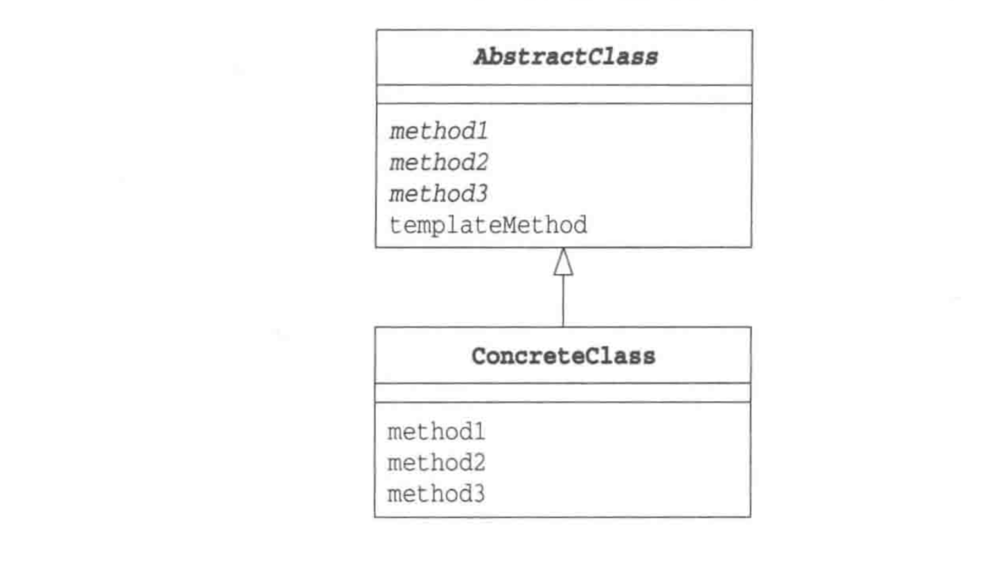

# Template Method Pattern 模版方法模式
## 解释
　 定义一个操作中算法的骨架，而将一些步骤延迟到子类中，模板方法使得子类可以不改变算法的结构即可重定义该算法的某些特定步骤。

　完成一件事情，有固定的数个步骤，但是每个步骤根据对象的不同，而实现细节不同；就可以在父类中定义一个完成该事情的总方法，按照完成事件需要的步骤去调用其每个步骤的实现方法。每个步骤的具体实现，由子类完成。
　
## 图解

  
 

抽象父类（AbstractClass）：实现了模板方法，定义了算法的骨架。

具体类（ConcreteClass)：实现抽象类中的抽象方法，即不同的对象的具体实现细节。

# 优点
* 具体细节步骤实现定义在子类中，子类定义详细处理算法是不会改变算法整体结构。

* 代码复用的基本技术，在数据库设计中尤为重要。

* 存在一种反向的控制结构，通过一个父类调用其子类的操作，通过子类对父类进行扩展增加新的行为，符合“开闭原则”。

# 不足
   每个不同的实现都需要定义一个子类，会导致类的个数增加，系统更加庞大。

  

